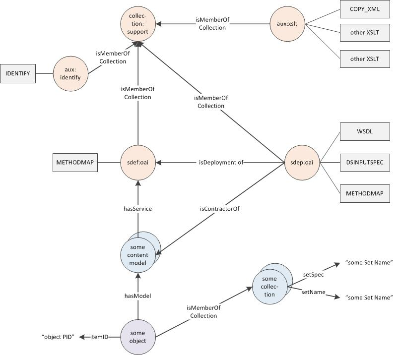
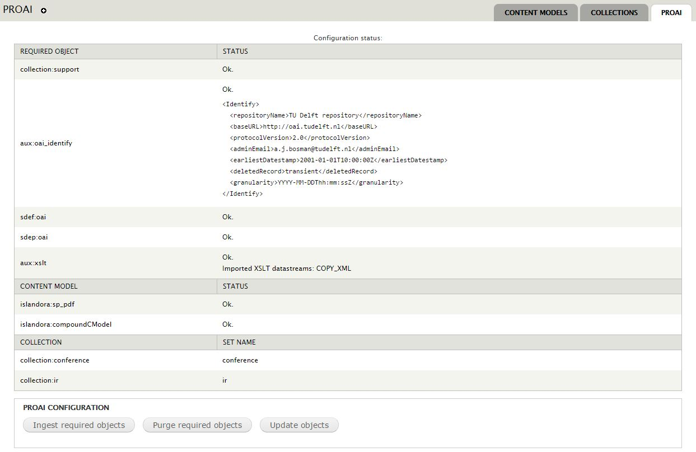
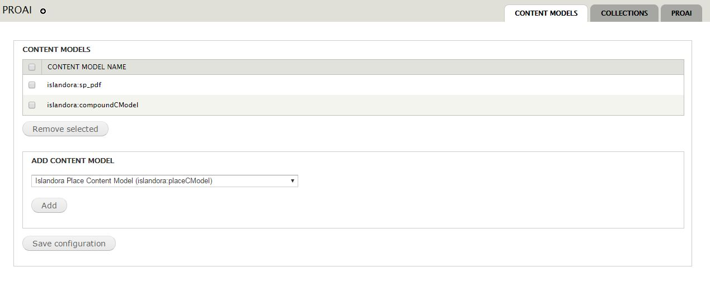
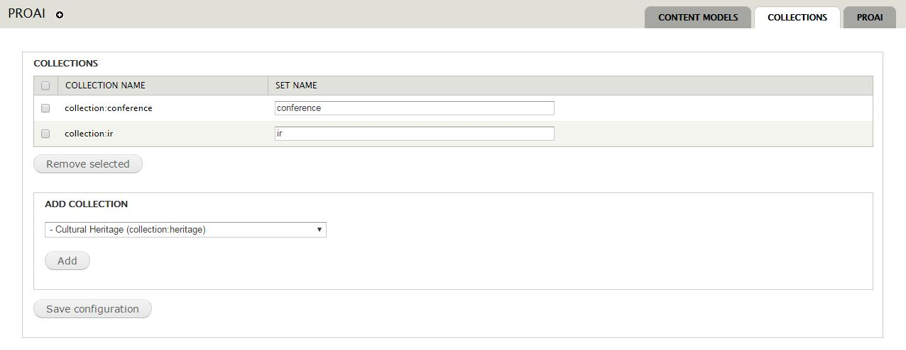

# Islandora PROAI 

## Introduction

This module provides an integration of Fedora's [OAI Provider Service 1.2.2] (https://wiki.duraspace.org/display/FCSVCS/OAI+Provider+Service+1.2.2) within Islandora. 
PROAI is based on Fedora's Content Model Architecture. It requires 5 special objects to be ingested in Fedora:

* sdef:oai
* sdep:oai
* aux:identify
* aux:xslt
* collection:support

The configuration form Administration » Islandora » Islandora Utility Modules » PROAI (admin/islandora/tools/proai) has buttons to ingest and purge these objects. Before ingesting again the objects have to be purged. 

###Relationships and datastreams of PROAI


**sdef:oai** is a service definition object. PROAI only provides OAI output for objects that have a content model that has a relationship *hasService* with **sdef:oai**.

**sdep:oai** is the deployment of the service. It contains datastream that can be customized.

**aux:identify** stores the response on the identify request in the datastream IDENTIFY. Modify /islandora_proai/xml/islandora_proai_identify_identify.xml and (purge and) ingest the required objects.

**aux:xslt** stores the XSLT's that are used in separate datastreams. An object that contains the xslt's that might be specified in the **sdep:oai** datastreams. One special datastream COPY_XML just copies the XML of the datastream.

**collection:support** is a collection in which previous objects are collected. 


Each object must have an extra relationship *itemID* (with namespace "http://www.openarchives.org/OAI/2.0/") in order to be harvestable. The button `Update objects (max 50)` updates 50 or less objects for testing. 

With a drush script this relationship can be added to existing objects. Usage of this script:
```
cd [installation path]/sites/default
drush php-script ../all/modules/islandora_proai/drush/update_objects.php
```

The module has a hook implementaion islandora_proai_islandora_object_alter that takes care of this when objects are created or altered.
  
Sets are implemented trough collections. Existing collections can be "activated" for PROAI in a special configuration form Collections.

Also content models must be "activated" for PROAI, this can be done in the special configuration form Content Models.


## Requirements

This module requires [PROAI] (https://sourceforge.net/projects/proai/).
* follow the [installation instructions] (https://wiki.duraspace.org/display/FCSVCS/OAI+Provider+Service+1.2.2)
* [configure] (https://wiki.duraspace.org/display/FCSVCS/OAI+Provider+Configuration+Reference) PROAI 
* examples of the configuration file and the log configuration are provided in this repository 

This module requires the following Islandora modules/libraries:

* [Islandora](https://github.com/islandora/islandora)
* [Tuque](https://github.com/islandora/tuque)

## Installation

Install as usual, see [this](https://drupal.org/documentation/install/modules-themes/modules-7) for further information.

## Configuration

Configure the module in Administration » Islandora » Islandora Utility Modules » PROAI (admin/islandora/tools/proai).

### Main configuration form


Start with ingesting the required objects. They can also be purged and ingested again, for instance after changing the xml files. Please note that the content models form has to be submitted again after purging and ingesting the required objects.

### Content models configuration form


After that activate the content models that are used in OAI. This has to be done after each reingest.

### Collections/sets configuration form


Then select the collections that are used as sets an give them the appropriate set names. 


##Example oai requests

* `*/oaiprovider?verb=Identify`
* `*/oaiprovider?verb=ListMetadataFormats`
* `*/oaiprovider?verb=ListSets`
* `*/oaiprovider?verb=ListIdentifiers&metadataPrefix=oai_dc`
* `*/oaiprovider?verb=ListIdentifiers&metadataPrefix=oai_dc&set=ir`
* `*/oaiprovider?verb=GetRecord&metadataPrefix=oai_dc&identifier=PID`
* `*/oaiprovider?verb=ListRecords&metadataPrefix=oai_dc`
* `*/oaiprovider?verb=ListRecords&metadataPrefix=oai_dc&set=ir`


## Customization

See the xml directory for information about customizing and adding or changing XSLT's

## Maintainers/Sponsors

Current maintainers:

* Frits van Latum


## License

[GPLv3](http://www.gnu.org/licenses/gpl-3.0.txt)
